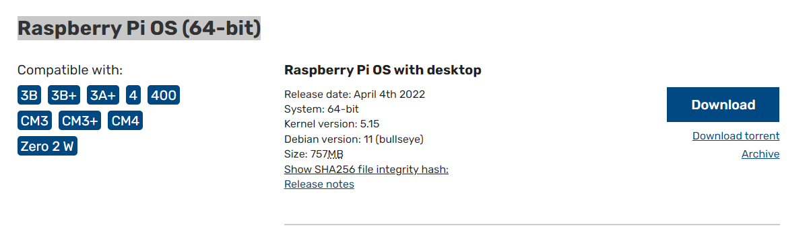
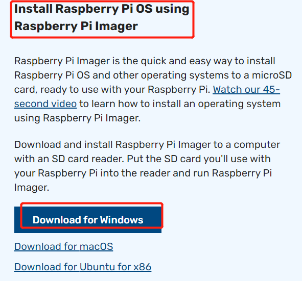
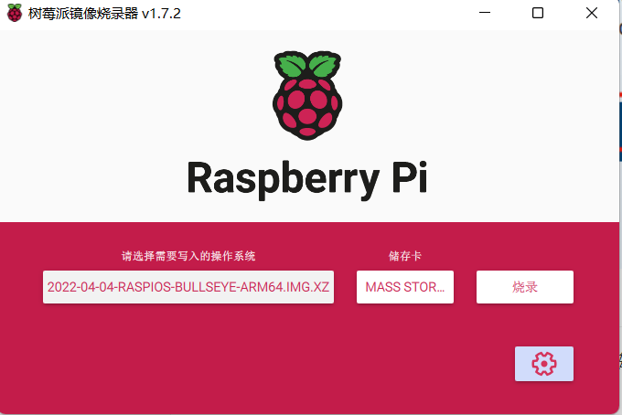
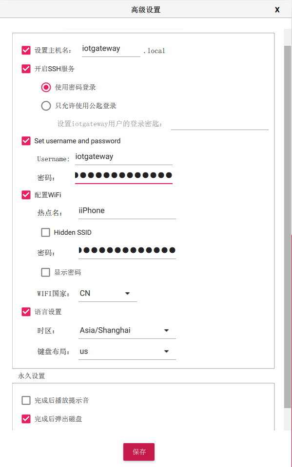

# 烧录系统

## 准备

- 树莓派4B+(3b以上都可以)
- TF卡
- TF读卡器
- HDMI显示器

## 下载镜像

在[树莓派官网](https://www.raspberrypi.com/software/operating-systems/)下载系统镜像，

从2022年2月开始，官方提供了64位系统，目前最新版本是基于Debian11(bullseye)的。

新手建议下载带桌面的版本即：Raspberry Pi OS with desktop。

## 下载镜像烧录工具

你可以使用其他镜像烧录工具，如**Win32DiskImager**等，

但是我还是**推荐官方镜像工具**，因为他可以在烧录镜像时直接**启用ssh**、并**配置WiFi**。

在树官网下载[镜像烧录工具](https://www.raspberrypi.com/software/)，并安装

## 烧录

1. 电脑插入TF卡
2. 打开镜像烧录工具
3. 选择自定义镜像（刚下载的）
4. 选择磁盘（TF卡盘符）

5. 初始配置

   点击右下角**齿轮**按钮，启用ssh、配置WiFi

   

   ## 运行

   1. TF卡插入树莓派
   2. 连接HDMI
   3. 上电开机

   ## 相关链接

   1. 树莓派64位镜像：https://downloads.raspberrypi.org/raspios_arm64/images/raspios_arm64-2022-04-07/2022-04-04-raspios-bullseye-arm64.img.xz

   2. 镜像烧录工具：https://downloads.raspberrypi.org/imager/imager_latest.exe