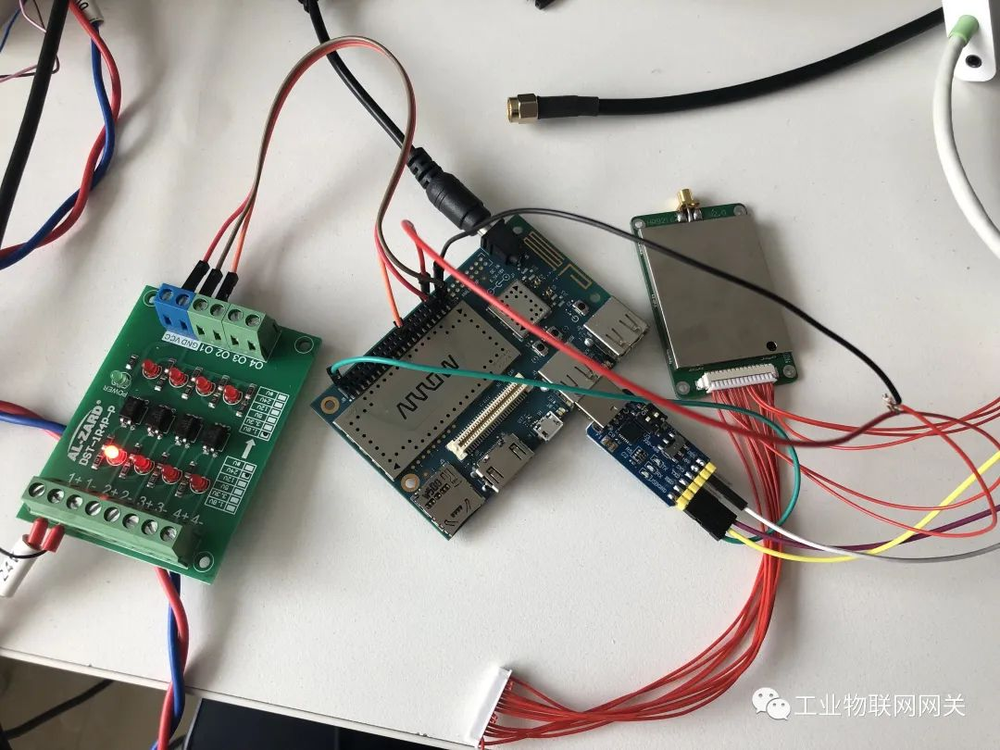
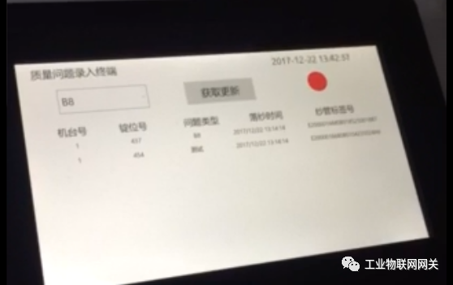
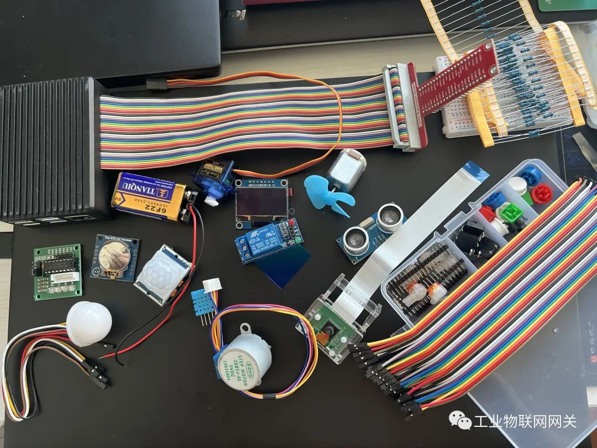

# .NET物联网从零开始
## 过去

近日搞硬件网关时，那些*残存*的**数电、模电和通信原理**的记忆时常在脑海中萦绕；

想起来多年前看**张高兴**的博客学习了**.netcore+树莓派**进行**物联网**开发。

使用dragonboard(龙板)搭载windows 10 iot系统，配合光电传感器和rfid实现了一个项目原型。

## 现在

碰巧逛github发现了**微软的iot初学课程**，是c++和python搞的，也没有中文翻译。

我看了眼用来**编译镜像**的树莓派，发现柜子中还有一些N年前买的**电子元器件**(进行了增补)

## 将来
是的我要搞一个**新系列**：**《.NET物联网从零开始》**。

**无套路**提供**接线图、文档、程序**。

感兴趣的话，你可以**看着我搞**或者**跟着我搞**(自己准备硬件)。

**新系列预计5章共16节。**

涉及树莓派、传感器、执行器、显示、相机、麦克风、扬声器等**硬件**。

在**农业、制造业、零售业、和消费领域**选择合适的场景设计**实验**。

其中图像识别使用**ML.NET**，语音使用**Azure**的服务。

**课程大纲如下：**

### **第一章-入门**

- 1.-1 树莓派
- 1.0 .NET6程序运行

- 1.1 物联网简介
- 1.2 传感器和执行器

### **第二章-农业**

- 2.1 温湿度检测
- 2.2 自动浇水
- 2.3 通过光照强度控制LED亮度

### **第三章-制造业**

- 3.1 训练香蕉质量检测器
- 3.2 使用树莓派拍照片
- 3.3 使用树莓派检测香蕉品质
- 3.4 使用距离传感器触发检测

### **第四章-零售业**

- 4.1 照片中的物体检测
- 4.2 库存识别

### **第五章-消费领域**

- 5.1 获取语音

- 5.2 识别语音

- 5.3 了解语言

- 5.4 提供语音反馈

- 5.5 多语言

## **相关链接**

[1] [IoT4Beginners](https://github.com/microsoft/IoT-For-Beginners)

[2] [.NetIoT](https://github.com/dotnet/iot)

[3] [ML.NET](https://dotnet.microsoft.com/zh-cn/apps/machinelearning-ai/ml-dotnet)

[4] [张高兴](https://blog.csdn.net/z5859095?type=blog)
